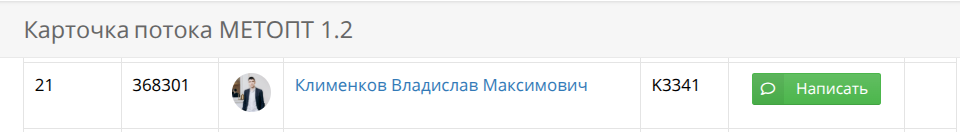
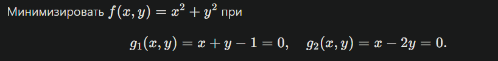

# Задание №3. Решение задачи условной выпуклой оптимизации с помощью метода множителей Лагранжа

## Ф.И.О.

Клименков Владислав Максимович

## Группа

K3341

## Поток

МЕТОПТ 1.2

## Вариант задания

Номер моей позиции в списке потока 21.

Значит в рамках данного задания я буду выполнять вариант №1:

Минимизировать $f(x,y)=x^2+y^2$ при

$$
g_1(x,y)=x+y-1=0,\quad g_2(x,y)=x-2y=0.
$$

## Решение

Итак, нам нужно найти минимум функции $f(x,y)=x^2+y^2$, который бы соответствовал бы следующим ограничениям:

- $g_1(x,y)=x+y-1=0$,
- $g_2(x,y)=x-2y=0$.

Сразу заметим, что система ограничений

$$
\begin{cases}
x+y-1=0\\
x-2y=0
\end{cases}
$$

имеет единственное решение $y=\frac{1}{3}$ и $x=\frac{2}{3}$, а значит это единственные возможные $x$ и $y$, которые может принимать минимизируемая нами функция $f(x,y)$. Подставим в неё полученные значения $y=\frac{1}{3}$ и $x=\frac{2}{3}$:

$$
f(x,y)=x^2+y^2=\left(\frac{2}{3}\right)^2+\left(\frac{1}{3}\right)^2=\frac{5}{9}
$$

Следовательно, $\frac{5}{9}$ и будет являться минимум данной функции, так как другие значения $x$ и $y$ не подойдут по ограничениям.

Однако в задании сказано воспользоваться для решения методом множителей Лагранжа, так что давайте применим его и сравним результаты с полученным выше ответом.

Так как у нас два ограничения, то введём два множителя Лагранжа $\lambda_1$ и $\lambda_2$ и составим функцию Лагранжа:

$$
L(x,y,\lambda_1,\lambda_2)=x^2+y^2+\lambda_1(x+y-1)+\lambda_2(x-2y)
$$

Далее составим систему уравнений, прировняв к нулю частные производные функции Лагранжа:

$$
\begin{cases}
\frac{\partial L}{\partial x}=2x+\lambda_1+\lambda_2=0\quad(1)\\
\frac{\partial L}{\partial y}=2y+\lambda_1-2\lambda_2=0\quad(2)\\
\frac{\partial L}{\partial\lambda_1}=x+y-1=0\quad(3)\\
\frac{\partial L}{\partial\lambda_2}=x-2y=0\quad(4)
\end{cases}
$$

Решим эту систему уравнений:

$(4)\quad\implies\quad x=2y$

$(3)\quad\implies\quad 2y+y-1=0\quad\implies\quad 3y=1\quad\implies\quad y=\frac{1}{3}$

$x=\frac{2}{3}$

Подставим найденные значения $x$ и $y$ в уравнения $(1)$ и $(2)$:

$$
\begin{cases}
2\cdot\frac{2}{3}+\lambda_1+\lambda_2=0\\
2\cdot\frac{1}{3}+\lambda_1-2\lambda_2=0
\end{cases}
$$

Решаем эту систему уравнений и получаем $\lambda_1=-\frac{10}{9}$ и $\lambda_2=-\frac{2}{9}$.

В результате была получена единственная стационарная точка:

$$
x=\frac{2}{3},\quad y=\frac{1}{3},\quad \lambda_1=-\frac{10}{9},\quad \lambda_2=-\frac{2}{9}
$$

Минимизируемая функция принимает в этой точке значение

$$
f\left(\frac{2}{3},\frac{1}{3}\right)=\left(\frac{2}{3}\right)^2+\left(\frac{1}{3}\right)^2=\frac{5}{9}
$$

которое и будет являться её минимумом.

В результате был получен тот же ответ, что и ранее, что дополнительно подтверждает корректность метода Лагранжа.

**Итоговый ответ:**

$$
\boxed{x=\frac{2}{3},\quad y=\frac{1}{3},\quad f_{min}=\frac{5}{9}}
$$

## Рефлективное заключение

В рамках данной задачи я попрактиковался в нахождении минимума функции с помощью метода множителей Лагранжа. Это полезно как в рамках общего развития, так и в практической сфере, если при дальнейшей работе потребуется проводить подобные расчёты.
